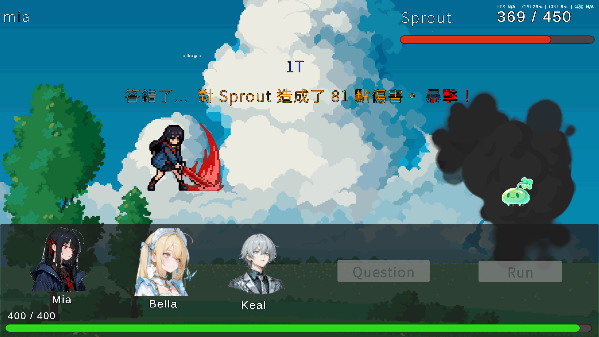
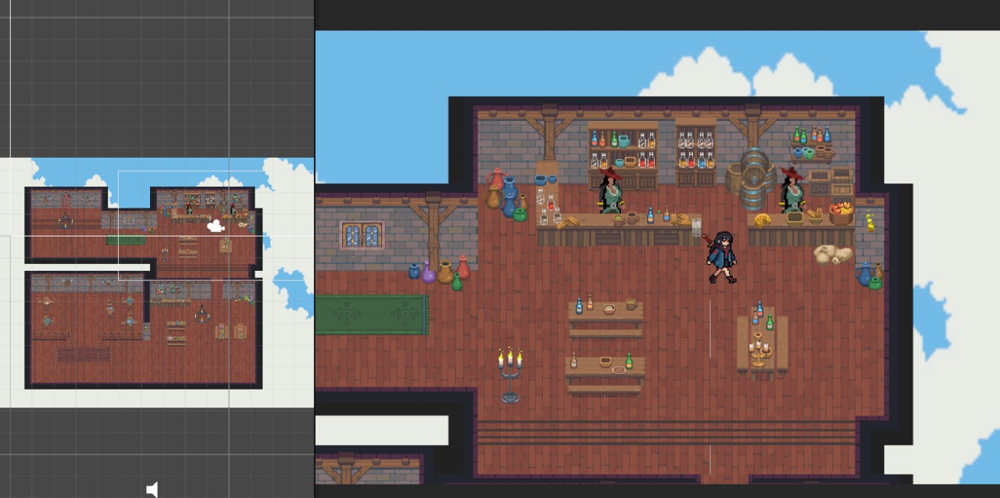
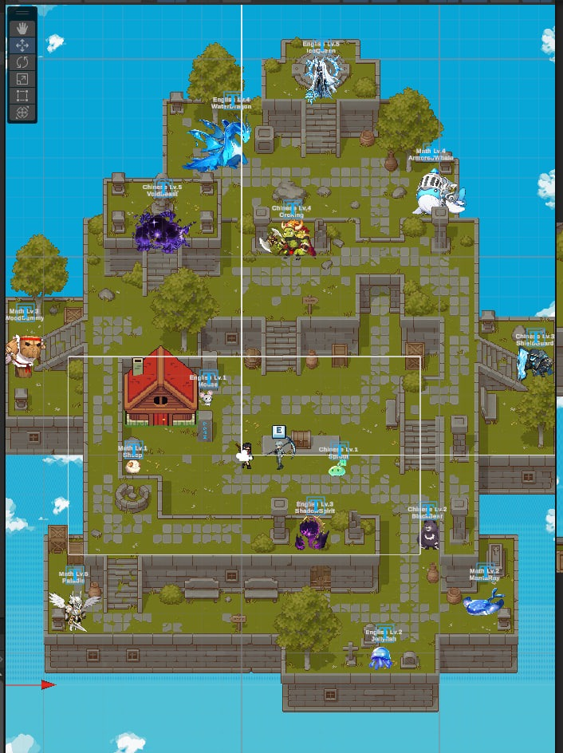
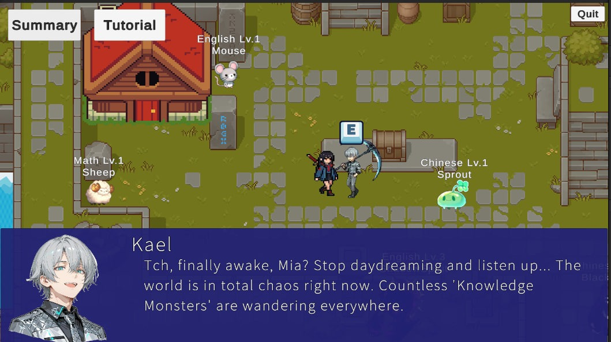
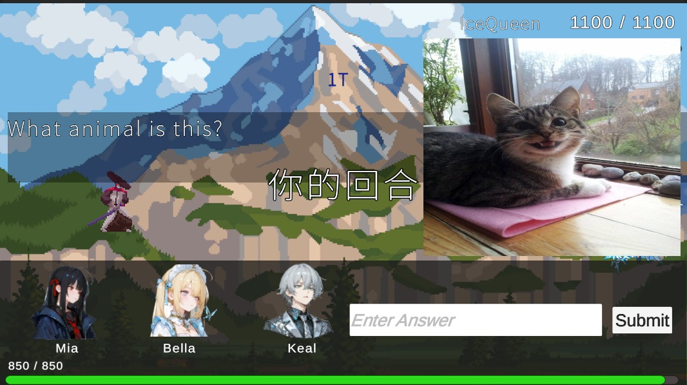
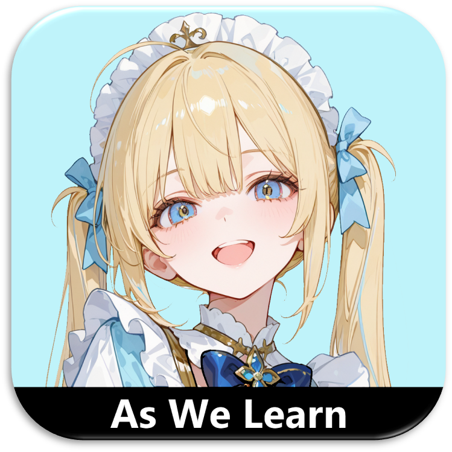
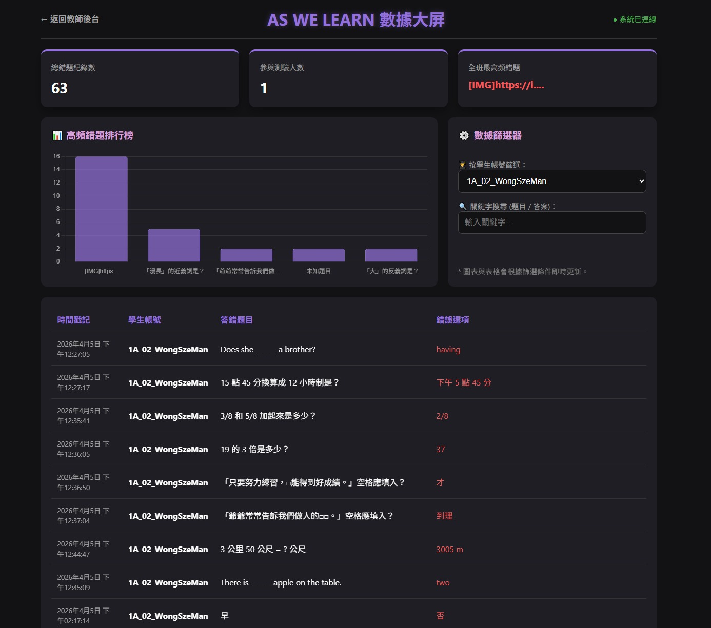

# As We Learn

**As We Learn** is a 2D educational RPG that turns classroom learning into an interactive adventure. Players explore a pixel-art world, meet story characters, battle subject-themed monsters, and answer questions to progress.

The project combines game mechanics, quiz-based learning, character dialogue, and teacher-facing data review so students can learn through play while teachers can observe common mistakes and learning patterns.

## Screenshots

> Put the screenshots inside `docs/images/` in your GitHub repository using the filenames below, or rename the paths to match your own image files.

<p align="center">
  
</p>

<p align="center">
  
</p>

<p align="center">
  
</p>

<p align="center">
  
</p>

<p align="center">
  
</p>

<p align="center">
  
</p>

<p align="center">
  
</p>

## Features

- Story-based learning with characters such as Mia, Bella, and Keal
- Pixel-art exploration map with subject-themed enemies
- Quiz battles where correct answers help players defeat monsters
- Multiple question types, including text answers and image-based prompts
- Tutorial dialogue to guide new players into the game world
- Health bars, battle feedback, and instant answer results
- Teacher dashboard for reviewing student mistakes and high-frequency questions
- Data filtering by student account and keyword search

## Gameplay Concept

Players move through an educational fantasy world where learning topics become encounters. Monsters represent different subjects and levels, such as English, Math, and Chinese. When players interact with an enemy, they answer a question. Their answer affects the battle result, turning revision into a more active and memorable experience.

## Teacher Dashboard

The teacher-facing dashboard helps review student learning data after gameplay. It highlights total wrong-answer records, participating students, high-frequency wrong questions, and detailed answer logs. This makes it easier to identify which topics need more support in class.

## Project Goals

- Make learning more engaging through RPG-style progression
- Encourage students to practise questions in a less stressful format
- Provide teachers with useful learning analytics
- Combine storytelling, gameplay, and revision into one experience

## Suggested Image Folder

```text
docs/
`-- images/
    |-- battle-scene.png
    |-- map-editor.png
    |-- world-map.png
    |-- tutorial-dialogue.png
    |-- question-battle.png
    |-- app-icon.png
    `-- dashboard.png
```

## Repository

GitHub: https://github.com/rachelqwq419/As-We-Learn-FYP

## Credits

Created as a Final Year Project by Rachel.
